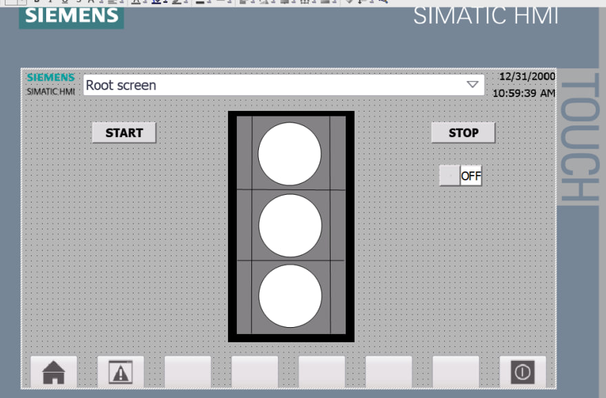
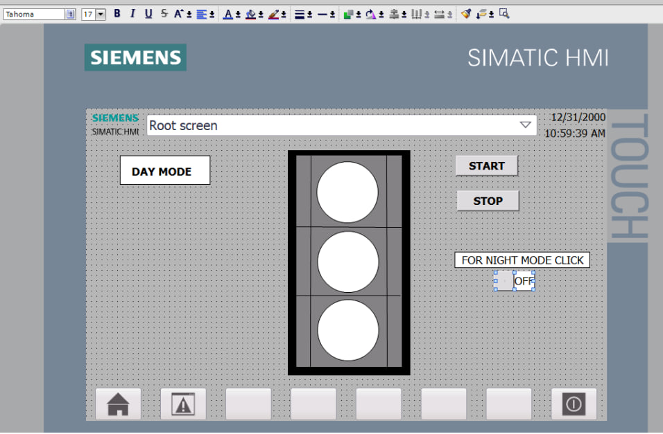

# 1. PLC Traffic Light Control System (FBD & HMI Visualization)

This repository contains a university engineering project focused on developing a 3-phase traffic light control system using **Function Block Diagram (FBD)** programming, compliant with the **IEC 61131-3** standard. The project includes the controller logic and an integrated **HMI (Human-Machine Interface)** screen for live simulation and monitoring.

---

## Project Description

The goal of this project was to implement a sequential traffic light cycle (Red -> Yellow -> Green) using cascading timer logic. Instead of interlocking flags, the state transitions are driven by three distinct timers, where the completion of one timer automatically initializes the next phase.

### Features:
* **Structured FBD Networks:** The logic is divided into clear networks to ensure easy debugging and modifications.
* **Cascading Timer Cycle:** Three independent timers manage the precise duration for each light phase.
* **HMI Dashboard:** A basic graphical interface linked directly to the PLC I/O to simulate real-world operation.

---

## You can see the HMI visualization here (just click to picture):

---

# 2.Adding Night Mode

This project focuses on updating the traffic light control system by introducing a flashing yellow signal mode for night operation, where the system automatically switches between day and night modes based on a set time or a control signal, while also updating the HMI visualization to display both modes of operation clearly.

---
# 3.Real-Time HMI Timer Adjustments and Pedestrian Control

This project involves developing a traffic light control program with three signals (red, yellow, green) where the duration of each signal is controlled by timers and can be adjusted directly from the HMI panel in real time. Additionally, a pedestrian enquiry function is implemented, which requires two pedestrian buttons to be pressed simultaneously to reduce the duration of the current active signal to its minimum value, allowing pedestrians to cross sooner. The HMI visualization is also updated to support real-time time editing and show the pedestrian button status.

